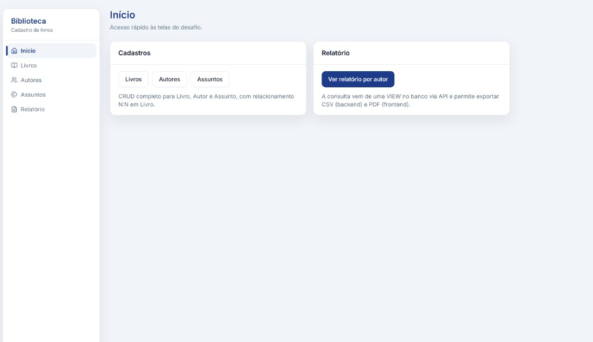
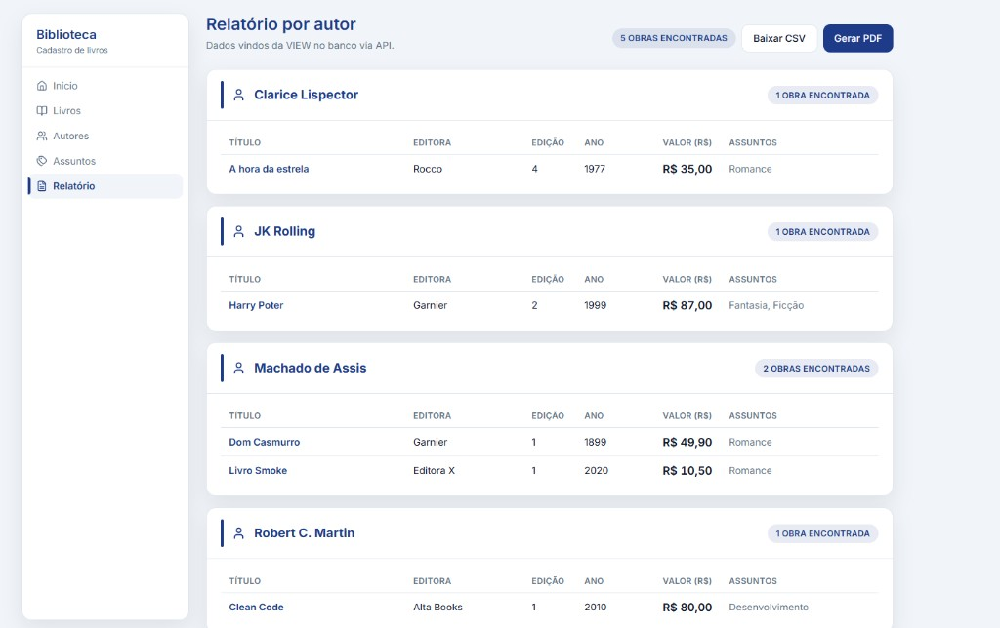

# Cadastro de Livros — Monorepo

Projeto **Web** de cadastro de livros, autores e assuntos (relacionamentos **N:N**), com **relatório por autor** alimentado por **VIEW** no PostgreSQL, API REST em Node e SPA em React.

Este repositório agrupa:

| Pasta | Conteúdo | Documentação |
|-------|----------|--------------|
| `biblioteca-livros-backend` | API REST, Prisma, migrations, seed, exportação **CSV** do relatório | [README do backend](biblioteca-livros-backend/README.md) |
| `biblioteca-livros-frontend` | React (Vite), UI, formatação de moeda, relatório na tela, **PDF** | [README do frontend](biblioteca-livros-frontend/README.md) |

```text
biblioteca-livros/
├── README.md
├── .gitignore
├── docs/
│   └── img/                    # capturas de ecrã (README)
├── biblioteca-livros-backend/
│   ├── prisma/                 # schema, migrations, seed, VIEW
│   ├── src/                    # API Express + módulos
│   └── docker-compose.yml
└── biblioteca-livros-frontend/
    └── src/                    # SPA React (features, components, hooks)
```

---

## Telas (capturas)

| Início — acesso rápido ao CRUD e relatório | Relatório por autor (VIEW via API, CSV e PDF) |
|--------------------------------------------|------------------------------------------------|
|  |  |

---

## Enunciado do desafio (resumo)

Conforme o teste técnico:

- **Objetivo:** aplicar boas práticas de mercado e apresentar o projeto na entrevista (base de dados, tecnologias, aplicação, metodologias, frameworks).
- **Stack Web** à escolha do candidato, incluindo banco e camada de persistência.
- **CRUD** de **Livro**, **Autor** e **Assunto** de acordo com o **modelo de dados** (ver abaixo).
- **Tela inicial** com menu simples ou links diretos.
- **Modelo de dados** respeitado de forma integral, salvo ajustes justificáveis de performance.
- **Interface** simples, com **CSS** controlando no mínimo cor e tamanho (no enunciado, **Bootstrap** é citado como *diferencial*; neste projeto usamos **Tailwind CSS** com tokens globais, no mesmo espírito).
- **Formatação** em campos que a pedem (ex.: **moeda** no livro).
- **Relatório obrigatório** cujos dados vêm de uma **VIEW** no banco; o “componente de relatório” no contexto Web é a **tela de relatório** + exportações; a consulta SQL fica na VIEW.
- **Agrupamento por autor**, atendendo a livros com **mais de um autor** (a VIEW produz linhas por par autor–livro; a UI agrupa por autor).
- **TDD** como *diferencial* (testes com **Vitest** no backend e no frontend).
- **Tratamento de erros** com mensagens claras; no backend, erros de validação, de negócio e códigos **Prisma** mapeados de forma específica (evitando respostas genéricas desnecessárias).
- Inclusão do campo **valor (R$)** no **Livro** (não estava no diagrama base).
- **Scripts e instruções de implantação** versionados (este README + READMEs por pasta + `prisma/migrations`).

---

## Modelo de dados (diagrama)

Entidades principais e junções (chaves e tipos alinhados ao enunciado):

- **Livro** — `Codl` (PK), `Titulo`, `Editora`, `Edicao`, `AnoPublicacao`, **`Valor`** (R$, acrescentado ao modelo base).
- **Autor** — `CodAu` (PK), `Nome`.
- **Assunto** — `codAs` (PK), `Descricao`.
- **Livro_Autor** — `Livro_Codl` (FK), `Autor_CodAu` (FK): relação **N:N** livro ↔ autor.
- **Livro_Assunto** — `Livro_Codl` (FK), `Assunto_codAs` (FK): relação **N:N** livro ↔ assunto.

Implementação: [`biblioteca-livros-backend/prisma/schema.prisma`](biblioteca-livros-backend/prisma/schema.prisma) e migrations em [`biblioteca-livros-backend/prisma/migrations/`](biblioteca-livros-backend/prisma/migrations/).

---

## Como rodar (desenvolvimento)

### Pré-requisitos

- **Node.js 20+**
- **Docker Desktop** (para subir o PostgreSQL via `docker compose` do backend)

### 1) Backend

Na pasta `biblioteca-livros-backend`:

```bash
copy .env.example .env
npm install
npm run db:up
npm run prisma:generate
npm run prisma:deploy
npm run prisma:seed
npm run dev
```

Por padrão a API fica em `http://localhost:3000` (ajustável via `PORT` no `.env`). O Postgres do Docker mapeia **`127.0.0.1:5433`** no hospedeiro — ver comentários em `.env.example`.

### 2) Frontend

Na pasta `biblioteca-livros-frontend`:

```bash
copy .env.example .env
npm install
npm run dev
```

`VITE_API_BASE_URL` deve apontar para a API (ex.: `http://localhost:3000`). Detalhes: [README do frontend](biblioteca-livros-frontend/README.md).

### Arranque rápido (dois terminais)

1. **Terminal 1 — backend:** na pasta `biblioteca-livros-backend`, executar os comandos da secção **1) Backend** acima (terminando com `npm run dev`).
2. **Terminal 2 — frontend:** na pasta `biblioteca-livros-frontend`, executar os comandos da secção **2) Frontend** acima.

---

## Troubleshooting

- **Erro de rede / CORS:** confirme `VITE_API_BASE_URL` no `.env` do frontend e que a API está a correr na mesma origem/porta esperada.
- **Relatório vazio:** na pasta do backend, execute `npm run prisma:seed` (o relatório depende da VIEW e de dados).
- **Postgres não conecta:** confirme que o Docker está ativo e que a porta **5433** no hospedeiro está livre (ou ajuste `DATABASE_URL` no `.env` do backend).

---

## Requisitos e implementação (checklist)

| Requisito | Onde está coberto |
|-----------|-------------------|
| CRUD Livro, Autor, Assunto | Rotas `/livros`, `/autores`, `/assuntos` + telas correspondentes |
| Menu / links na entrada | `HomePage` e rotas no frontend |
| Modelo + valor R$ | Schema Prisma + `CurrencyInput` no formulário de livro |
| Relatório com dados da VIEW | `vw_relatorio_livros_por_autor` + `GET /relatorios/livros-por-autor` |
| Agrupar por autor (vários autores por livro) | VIEW com uma linha por autor–livro; UI agrupa por autor |
| Exportação / relatório utilizável | Lista na SPA + CSV (API) + PDF (`@react-pdf/renderer`) |
| CSS estruturado | Tailwind + variáveis CSS (cores, tipografia, espaçamento) |
| Erros tratados | Middleware de erro no backend; `toApiError` no frontend |
| Testes (TDD como diferencial) | `npm test` em ambos os projetos |
| Scripts de implantação | Docker compose, Prisma migrate/seed, READMEs |

---

## Licença

ISC — ver `package.json` em cada subprojeto.
